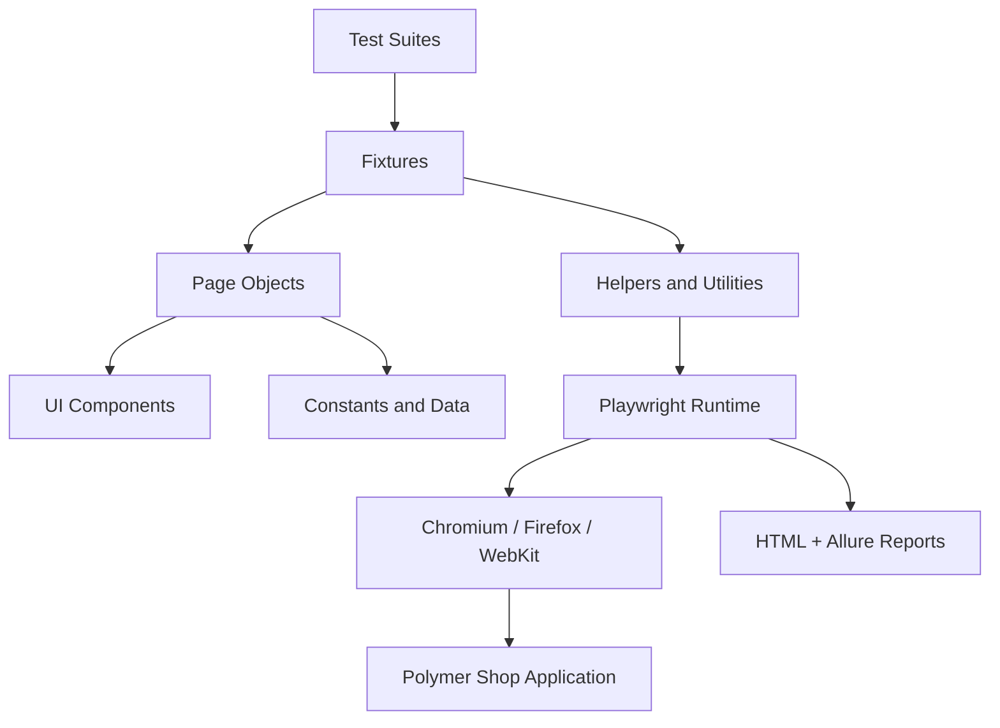

# Playwright Polymer Shop Automation Framework

Playwright + TypeScript automation framework for the Polymer Shop demo site.


[](https://github.com/Rutuja-code/Playwright-Polymer-Shop-Automation/actions/workflows/playwright.yml)
[](https://github.com/Rutuja-code/Playwright-Polymer-Shop-Automation/actions/workflows/security.yml)
[](LICENSE)


## Why this framework exists

This repository provides focused UI and HTTP checks for the Polymer Shop demo site, using page objects, shared fixtures, deterministic JSON test data, reporting, CI execution, and security checks.

## Professional GitHub presentation

The repository includes:
- a polished GitHub banner and badges
- a concise README and architecture overview
- contributor and review templates
- release automation and dependency updates
- security-focused CI workflows

## Ownership and branding

Maintainer: Rutuja Raikar

The framework targets the public Polymer Shop demo application. It does not implement authentication because that application does not expose a login workflow.

## Architecture overview

```text
tests/                -> smoke / sanity / regression suites
pages/                -> page objects for each application page
components/           -> reusable UI components
fixtures/             -> custom Playwright fixtures
helpers/              -> logger, retry-aware utilities
utils/                -> assertions, waits, screenshots, state capture
constants/            -> routes, selectors, and shared values
data/                 -> JSON-driven test data
config/               -> environment configuration
reports/              -> HTML + Allure outputs
.github/workflows/    -> CI and security workflows
```

### Architecture diagram



## Framework highlights

- Page Object Model and Component Object Model
- Reusable fixtures and abstraction layers
- Cross-browser and mobile execution
- HTML, Allure, screenshot, video, and trace reporting on failure
- Environment-based configuration using dotenv
- Stronger assertions and reusable utilities for maintainable tests
- Security-focused repository hygiene and CI checks
- Deterministic product-flow and HTTP coverage

## Tech stack

- Playwright Test
- TypeScript
- Node.js
- dotenv
- Allure
- GitHub Actions
- Winston logging

## Project structure

- pages/: page objects for home, category, product, and cart flows
- components/: shared UI components such as header and footer
- fixtures/: test fixture wiring for application objects
- utils/: reusable helpers for waits, assertions, screenshots, and context capture
- constants/: centralized routes and selectors
- data/: JSON-driven test data for products and users
- config/: environment management
- reports/: outputs for execution artifacts and reporting

## Installation

```bash
npm install
npx playwright install --with-deps
```

## Local execution

```bash
npm test
npm run test:smoke
npm run test:sanity
npm run test:regression
npm run test:headed
npm run test:debug
```

## Cross-browser execution

```bash
npx playwright test --project=chromium
npx playwright test --project=firefox
npx playwright test --project=webkit
npx playwright test --project=mobile-chromium
```

## Reporting

```bash
npm run report
npm run allure:report
```

## CI/CD

The repository includes:
- a Playwright workflow for automated execution on push and pull request
- a security workflow for dependency auditing and secret scanning
- artifact upload for HTML reports, test results, and Allure output

## Security posture

Security considerations are built into the repository by design:
- secrets stay in environment variables and example files only
- dependency auditing is part of CI
- logs and artifacts are kept clean and non-sensitive
- the repo includes a dedicated security policy

## Custom engineering-style utility

The framework includes a lightweight context-capture utility in [utils/test-context.ts](utils/test-context.ts) that captures the current URL and page title for better debugging and more intentional test diagnostics.

## Demo preview


## Pre-push checklist

Before pushing to GitHub, confirm the following:
- [ ] all tests pass locally
- [ ] dependency audit is clean
- [ ] security workflow is configured and visible
- [ ] README and ownership details are complete
- [ ] no secrets are committed
- [ ] reports and local artifacts are not published unintentionally
- [ ] the repository looks polished enough for recruiter and hiring-manager review
